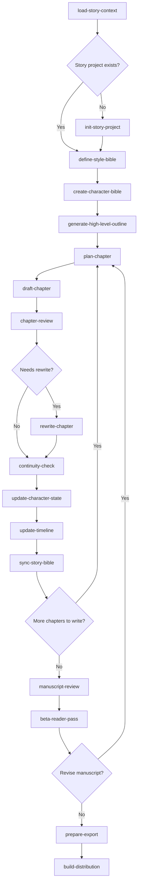

# Narrative Skills

Repository of narrative-writing skills for agentic fiction workflows.

These skills are designed to let a coding-oriented console agent work as a story assistant with persistent files, explicit editorial artifacts, and a repeatable manuscript workflow.

## Installation

Use [scripts/install-skills.sh](/home/rgarcia/Projects/narrative-skills/scripts/install-skills.sh) to install all skills for Codex, Claude Code, or OpenCode.

If you run the script without arguments, it prints the help instead of installing anything.

Supported install modes:
- `symlink`
- `copy`

Examples:

```bash
scripts/install-skills.sh --target codex --mode symlink
scripts/install-skills.sh --target claude-code --target opencode --mode copy
scripts/install-skills.sh --target all --mode symlink --force
scripts/install-skills.sh --target all --mode symlink --in-repo
```

Default target directories:
- Codex: `${CODEX_HOME:-$HOME/.codex}/skills`
- Claude Code: `${CLAUDE_CODE_HOME:-${CLAUDE_HOME:-$HOME/.claude}}/skills`
- OpenCode: `${OPEN_CODE_HOME:-${OPENCODE_HOME:-$HOME/.config/opencode}}/skills`

If you want a repository-local install for testing, use `--in-repo`. By default it writes into the repository you run the script from, or the current directory if that directory is not inside a Git repository. It writes to:
- `.codex/skills`
- `.claude/skills`
- `.opencode/skills`

You can override paths with `--codex-dir`, `--claude-dir`, `--opencode-dir`, or change the local install base with `--repo-dir`.

## Repository conventions

- The current working directory is the root of the story project.
- Core metadata lives in `story.yaml`.
- File and folder names stay in English for automation stability.
- Human-readable content is written in the selected `story.language` with normal orthography and Unicode.
- The canonical project structure is created by `init-story-project`.

## Skills

### Project setup and shared context

- `load-story-context`: Reads the current story workspace, validates `story.yaml`, normalizes shared metadata, and identifies missing or inconsistent project context.
- `init-story-project`: Creates or normalizes the base story-project structure, persists the minimum briefing, and initializes the metadata contract.
- `define-style-bible`: Builds the prose, voice, POV, lexical, and taboo rules that govern all future drafting and review.

### Story design

- `create-character-bible`: Defines the protagonist, supporting cast, and core dramatic relationships in narratively useful terms.
- `generate-high-level-outline`: Converts premise, cast, and intent into a three-act structure and chapter map with real progression.

### Chapter workflow

- `plan-chapter`: Produces an operational chapter plan with beats, POV, conflict, emotional progression, and continuity watchpoints.
- `draft-chapter`: Writes a full chapter draft from the persisted plan, style bible, character state, and continuity files.
- `chapter-review`: Reviews a drafted chapter for narrative, stylistic, and structural issues and writes actionable editorial feedback.
- `rewrite-chapter`: Revises a chapter draft from its review while keeping a separate revision artifact for traceability.
- `continuity-check`: Detects contradictions, ambiguity, new canon facts, and open-thread changes, then updates continuity records carefully.
- `update-character-state`: Persists dynamic character state after a stable chapter or rewrite.
- `update-timeline`: Synchronizes chronology and dated canon facts after a stable chapter or rewrite.
- `sync-story-bible`: Synchronizes chapter status, open loops, synopsis-level state, and workflow metadata after accepted changes.

### Manuscript-level feedback

- `manuscript-review`: Reviews a partial or full manuscript at story level for structure, pacing, arc development, and cumulative coherence.
- `beta-reader-pass`: Simulates reader-experience feedback focused on engagement, confusion, payoff, and emotional traction.

### Packaging and delivery

- `prepare-export`: Builds a clean reader-facing export package under `08_exports/` from accepted manuscript state.
- `build-distribution`: Converts the export package into distribution formats such as HTML, EPUB, and PDF when the required backend is available.

## End-to-end workflow



## Recommended usage pattern

1. Initialize or load the project state.
2. Define style, characters, and high-level outline.
3. For each chapter, iterate through plan, draft, review, rewrite if needed, and sync.
4. Once enough material exists, run manuscript-level and reader-level passes.
5. Export the accepted manuscript state and convert it into distribution formats.

## Example fixture

The repository includes a full sample project in [examples/ashes-under-the-tide/README.md](/home/rgarcia/Projects/narrative-skills/examples/ashes-under-the-tide/README.md) and a dogfood summary in [examples/dogfood-report.md](/home/rgarcia/Projects/narrative-skills/examples/dogfood-report.md).
