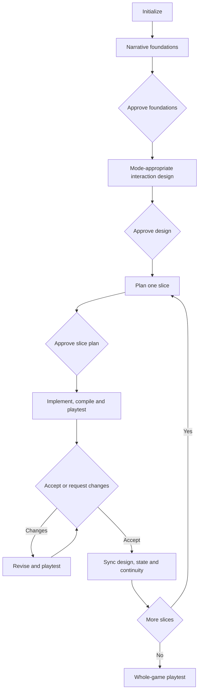

# Ink Interactive Fiction Workflow

The user needs to remember only `$write-ink-fiction`.

## 1. Choose the experience

```text
Use $write-ink-fiction to start a branching mystery in Spanish.
```

The skill supports:

- `linear`: presentation and light interaction with little persistent state;
- `branching`: consequential choices, reconvergence, variables, and multiple routes;
- `exploratory`: locations, revisits, free-order dialogue, gates, and explicit progression.

Existing projects that declare a free 2D map or free-order conversations are recognized as exploratory.

## 2. Continue through milestones

```text
Use $write-ink-fiction to continue.
```



The implementation milestone runs `inklecate` when available. Without it, the skill performs static review and records that runtime compilation was not verified.

## 3. Direct control remains available

```text
Use $write-ink-fiction status.
Use $write-ink-fiction to plan the archive-door obstacle.
Use $write-ink-fiction to diagnose why the second ending is unreachable.
I approve this slice. Synchronize it with $write-ink-fiction.
```

The skill loads only the relevant Ink language references for each syntax feature.
