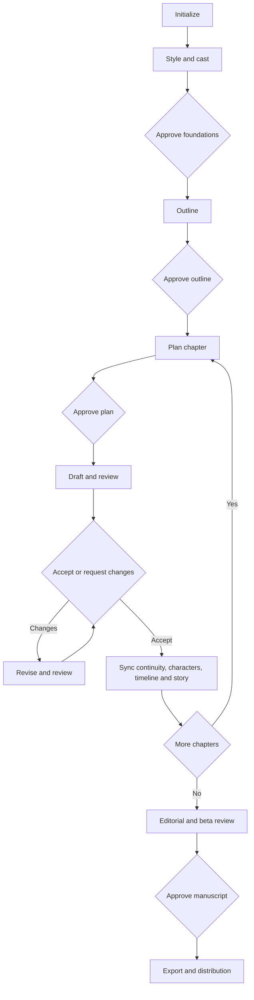

# Prose Fiction Workflow

The user needs to remember only `$write-fiction`.

## 1. Start

```text
Use $write-fiction to start a six-chapter science-fiction story in Spanish.
```

The skill persists the brief and creates the minimum useful project structure. Subsequent calls inspect `story.yaml` and existing artifacts rather than relying on chat memory.

## 2. Continue through creative milestones

```text
Use $write-fiction to continue.
```

The default progression is:



At an approval boundary, `continue` reports what is pending without assuming acceptance. Use an explicit response such as:

```text
I approve the plan. Continue with $write-fiction.
Revise the ending beat so the revelation comes from Mara, then use $write-fiction.
```

## 3. Check status or target work

```text
Use $write-fiction status.
Use $write-fiction to review the dialogue in chapter 4.
Use $write-fiction to prepare only an EPUB export.
```

`status` does not write files. A targeted request overrides automatic routing only for the named scope.
